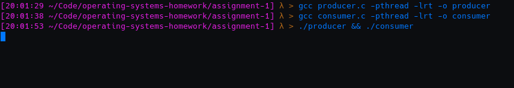
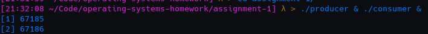
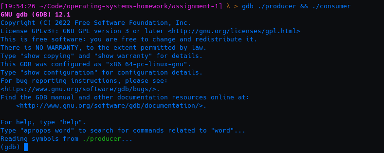

# The Programs** 

This project contains 2 programs: producer.c and consumer.c

producer.c takes in two integers as input from the user. It writes these integers to a table, which is stored in shared memory.

consumer.c accesses the shared memory location provided by producer.c and reads the two values, then adds them together and prints the sum. 

In order to ensure that consumer.c does not attempt to add together two null values, we sync the two processes with a semaphore. After the shared memory location is created, producer.c creates a semaphore and then attempts to enter its critical section, where it gathers user input. Consumer.c must wait for the semaphore to allow it to enter its critical section, where it will add the user input and then print the final sum. 

# The Problems

For some reason, the processes are unable to enter main(). I'm deeply confused by this, I've never seen it happen in any of the C and C++ programs I've written, not even when working in environments where a main function won't be loaded automatically (because there is no kernel and you have to manually jump into it). 

Running it exactly as recommended, ./producer & ./consumer &, results in a strange output that I'm not sure how to interpret. When I initially read that this was how we were expected to run the programs, I assumed it was some sort of typo. Repeatedly running it in this manner generates 2 new pieces of output, with each component incremented by 1. It's very interesting and strange to me but I have no idea what it's doing.

I loaded it up in the GNU Debugger to try and understand what was going wrong, but it didn't get to a point where it was able to, because it was not running. 

Even attempting to force it to run, with the **continue** and **jump** commands didn't work.

I've been trying to figure out what's wrong for a while now and have come up with nothing. I can't find other people online with similar problems, as most people who are unable to get to main fundamentally misunderstood C. 

# Compiling and Running**
Both programs can be compiled and run using the included Makefile with the command **make run**. Created files can be removed with **make clean.**

You can also manually compile and run the programs with the following commands:
- gcc producer.c -pthread -lrt -o producer
- gcc consumer.c -pthread -lrt -o consumer
- ./producer && ./consumer
