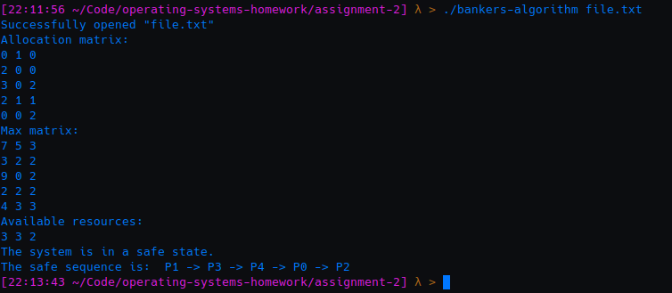

# Introduction

This is a C implementation of the banker's algorithm for resource allocation and deadlock avoidance. The banker's algorithm allocates resources to processes, never exceeding a pre-determined maximum, and checks to ensure that the system is in a safe state before proceeding with allocation. 

# Compiling and Executing

Compile and execute the program with the following commands:
```
gcc bankers-algorithm.c -o bankers-algorithm
./bankers-algorithm <input file>
```

"file.txt" has been provided alongside the program as a sample input file. The program will not run without an input file. 

If run correctly, you should receive output that looks something like this:


# Creating Custom Input

Any input file must be a .txt file and it must be in exactly the same format as the provided sample input. There should be a total of 5 rows and 9 columns. The first 3 columns should hold the starting allocation values. Columns 4-6 should hold the maximum amount of each resource that a process might request. In columns 7-9, only the first row should be filled, and they should contain the values of the initial remaining available resources. There should be 1 space between each column.

Sample:
```
0 1 0 7 5 3 3 3 2
2 0 0 3 2 2
3 0 2 9 0 2
2 1 1 2 2 2
0 0 2 4 3 3
```
